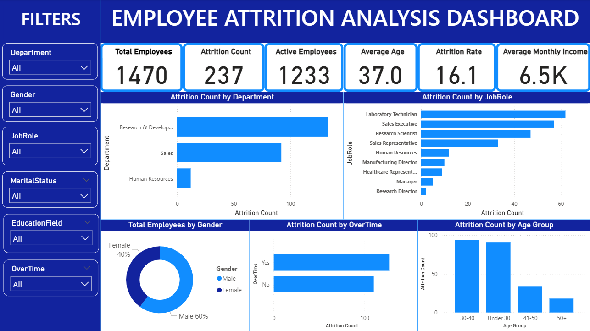

# HR Analytics Dashboard

## Project Overview
This project analyzes employee attrition and workforce trends using Python, MySQL, and Power BI. The goal is to identify key factors influencing employee turnover and provide actionable workforce insights through an interactive dashboard.

## Tools Used
- Python
- SQL (MySQL)
- Power BI
- Excel

## Key Features
- Data Cleaning and Transformation
- Employee Attrition Analysis
- KPI Dashboard
- Department and Job Role Insights
- Interactive Filters and Visualizations

## Dashboard KPIs
- Total Employees: 1470
- Attrition Count: 237
- Active Employees: 1233
- Average Age: 37.0
- 0Attrition Rate: 16.1%
- Average Monthly Income: 6.5k 

## Dashboard Preview

## Key Insights
- Sales Department has the highest attrition.
- Employees under 30 show higher attrition.
- Overtime significantly impacts employee retention.
